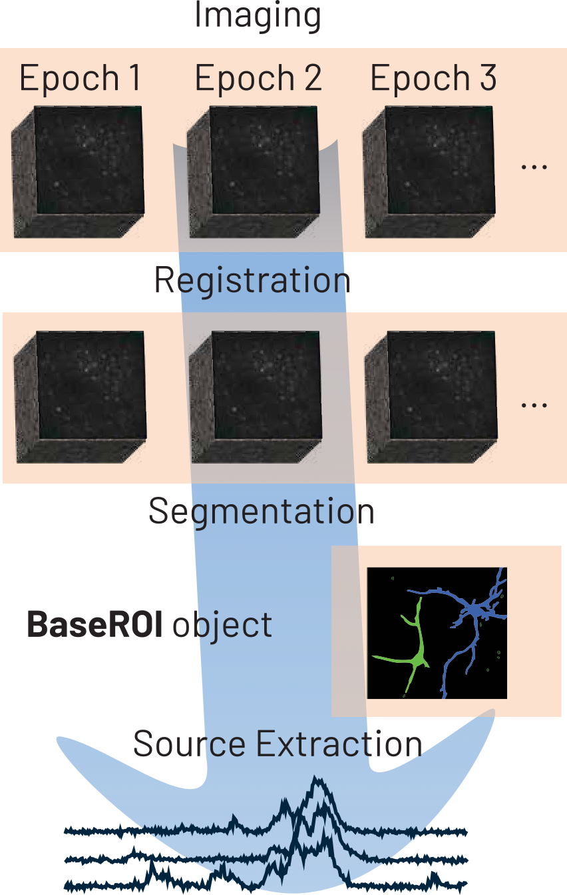
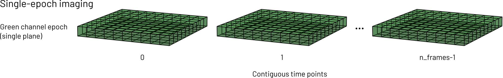
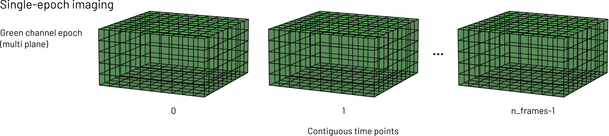
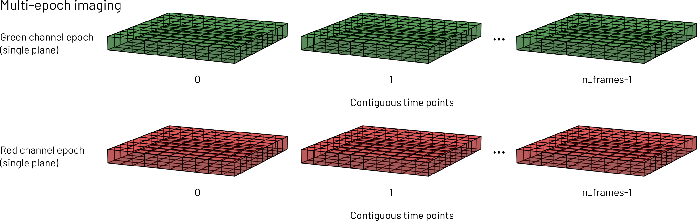
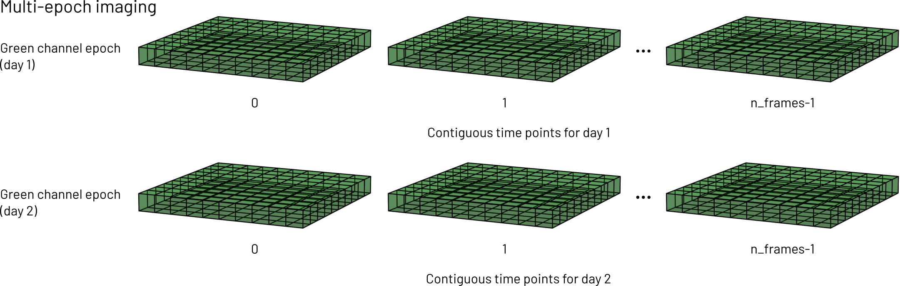

# For Developers

## Developer installation

Developers can clone `photon-mosaic` from GitHub

```bash
git clone https://github.com/photon-mosaic/photon-mosaic.git
cd photon-mosaic
```

and install with their favourite environment management tool (for example, [the `uv` tool](https://docs.astral.sh/uv/getting-started/installation/)).

```bash
uv venv
source .venv/bin/activate
uv pip install -e .
```

## The `photon-mosaic` architecture

This section provides an introduction to the high-level software architecture of the `photon-mosaic` API, for software developers.

### Prerequisites

Initial familiarity with
- object-oriented software development
- lazy evaluation of operations on chunked arrays
- multi-photon times series analysis

### Multi-photon time series analysis

On a conceptual level, analysing multi-photon time series typically means performing a series of image processing steps resulting in a number of regions of interest (ROIs). From each ROI, we then extract its (one-dimensional) temporal signal ("trace"), which can be processed further.

:::{note}
While we can still _conceptually_ think of analysis as a linear sequence of steps, some algorithms simultaneously segment the ROIs and extract their temporal signal, e.g. by minimising a function that depends on both.
:::



For image processing, `photon-mosaic` defines its own data structures to represent multi-photon time series (`Imaging` and `Epoch`) and ROIs (classes derived from `BaseROIs`). Signal extraction from ROIs, and further signal processing steps are encoded in `AnalyzerExtensions` which are wrapped into an `Analyzer` class.

We provide notebooks demonstrating how we envision usage of `photon-mosaic` in [our examples folder on GitHub](https://github.com/photon-mosaic/photon-mosaic/tree/dev/examples).

:::{admonition} Analogy to `spikeinterface`
:class: note

For people familiar with the [`spikeinterface` project](https://spikeinterface.readthedocs.io/en/stable/), `Imaging` objects can be thought of as analogous to `Recording` objects in `spikeinterface`, while an `Epoch` can be thought of as analogous to a `Segment`. `Analyzer` and `AnalyzerExtension` classes have [equivalents of the same name](https://spikeinterface.readthedocs.io/en/stable/modules/postprocessing.html#) in `spikeinterface`.
:::

### Module scopes

The `photon-mosaic` Python package has a [number of submodules](./api_index.rst) with distinct scope:

| Module | Scope |
| --- | --- |
| Core |  Base class definitions, analyzers, core utility functions |
| Extractors | Classes that allow extraction of `photon-mosaic` objects from a range of file formats |
| Preprocessing | Motion correction and other pre-processing steps (return `Imaging` objects) |
| Sample Data | Provision of public example data for manual testing and examples |
| Segmentation | ROI segmentation algorithms (take `Imaging`, return `ROIs`) |
| Widgets | Interactive IPython widgets for plotting in notebooks |

Note that each submodule has its own `tests/` folder for unit tests.

### The mental model for `Imaging` and `Epoch` objects

`photon-mosaic` takes an object-oriented approach to represent multi-photon time series. Two types of object are central to this: `Imaging` objects represent a collection of  multi-photon time series that are (approximately) contiguous in space. One or several `Epoch` objects are contained within an `Imaging` and represent multi-photon time series that are (exactly) contiguous in space _and_ channel _and_ time. This concept is visualised below:




Single- and multi-plane time series are stored in the same `Epoch`...




... but different channels, and time series that were interrupted (e.g. consecutive days) belong in different `Epoch` objects, but the same `Imaging` object (assuming they were taken from the same anatomical location).

For example, let's say someone acquires a 2-channel time series of a certain brain region. The acquisition is repeated daily, on the same animal and region, for three days. In this case, each day's time series would be two epochs (one per channel) containing all planes, and all the data would live in the same `Imaging` object, which would contain six epochs (3 days by 2 channels).

Time series of different brain regions should be kept in separate `Imaging` objects. Sometimes, adhering to this mental model requires splitting or merging of input data. `photon-mosaic` provides functionality for this.

We intend the wider `photon-mosaic` code and external code to interact with `Imaging` functionality directly, while `Epoch` functionality should generally not be called outside the `Imaging` it belongs to. `Imaging` objects will delegate many computations to their `Epoch` objects as appropriate.

To support time series that do not fit into memory, `Imaging` objects typically read and process data _lazily_. The `.get_series()` method is the "final" operation, i.e.:

```python
data_subset = imaging.get_series(
        start_frame=50,
        end_frame=500,
        plane_ids=[2,3],
        epoch_index=0
    )
```

returns an in-memory `numpy` array containing the frames 50 to 500 of the first epoch, for two planes. It is the calling code's responsibility to ensure this subset of the data fits into memory.

Under the hood, laziness in `imaging.get_series` relies on the `Imaging` initialiser keeping track of required operations. As an intuitive example, consider the task of reading a time series from disk and performing registration on it. The raw time series loading step is an `Imaging` that points to a file, and the registration is a preprocessing step that keeps track of the loading `Imaging` and (eagerly) pre-computes the displacement field. When `.get_series` is called, the code recursively works through the tree of required operations and applies it to the requested data (in this example, loading from file, and applying the displacement field to it).

Note that intermediate results are not cached implicitly, so after computationally expensive steps (e.g. registration) it is likely worth writing to file.

### `ROIs` objects

The [`segmentation` module](./api/segmentation.rst) provides functionality that spatially segments `Imaging` objects and returns a `ROIs` object.

#### `Analyzer` and `AnalyzerExtension` objects

`Analyzer` objects combine `Imaging` and `ROIs`. They provide a `compute` function that takes the name of an `AnalyzerExtension` as a string (and possibly more arguments). Different extensions may depend on each other (e.g. the `df_over_f` extension depends on the `fluorescence_trace` extension), and calling `compute` on an extension that depends on another extension that is not yet computed will raise an error.

### Reading and writing data

The [`extractors` module](./api/extractors.rst) reads data written by external software (e.g. ScanImage acquisitions or Suite2p ROIs). We partially rely on the [`roiextractors` package](https://roiextractors.readthedocs.io/en/latest/index.html), which we dynamically wrap, to support reading a wide range of raw input time series. Sometimes, we may write our own extractor (e.g. for some of `suite2p`'s output files). In accordance with the mental model above, we ensure we return `Imaging` objects with appropriate metadata, containing `Epoch` objects that are always four-dimensional arrays (time, height, width, planes), lazily.

We support reading and writing `Imaging` and `ROIs` object natively to `binary` and `zarr` formats.

### Provenance tracking

 `Imaging` and `ROIs` objects have the additional responsibility for keeping track of metadata around the operations (lazily) applied to them, i.e. provenance. They do this via updating their internal dictionary `self._kwargs` with algorithm parameters and `self._parent_imaging`/`self.parent_rois`. This enables us to traverse a nested series of earlier steps' metadata and establish provenance.

### Exposing a functional API to users

Outward-facingly, we prefer to expose functions rather than classes to users and libraries depending on `photon-mosaic`. This is because we think this is more elegant and user-friendly.

Pattern

```python
class DoSomething:

do_something = DoSomething
```

For external collections of classes we might want to wrap, this can be done dynamically, using the Python standard library's `inspect` module.
Examples of this include:

* [(static) `read_binary_imaging/BinaryFolderImaging` ](https://github.com/photon-mosaic/photon-mosaic/blob/43cfc029f16639b7a9a8258207e5798803c3486f/src/photon_mosaic/core/binaryimaging.py) (line 257)

* [(dynamic) extractor classes for `roiextractors`](https://github.com/photon-mosaic/photon-mosaic/blob/43cfc029f16639b7a9a8258207e5798803c3486f/src/photon_mosaic/extractors/roiextractors.py) (line 55)
